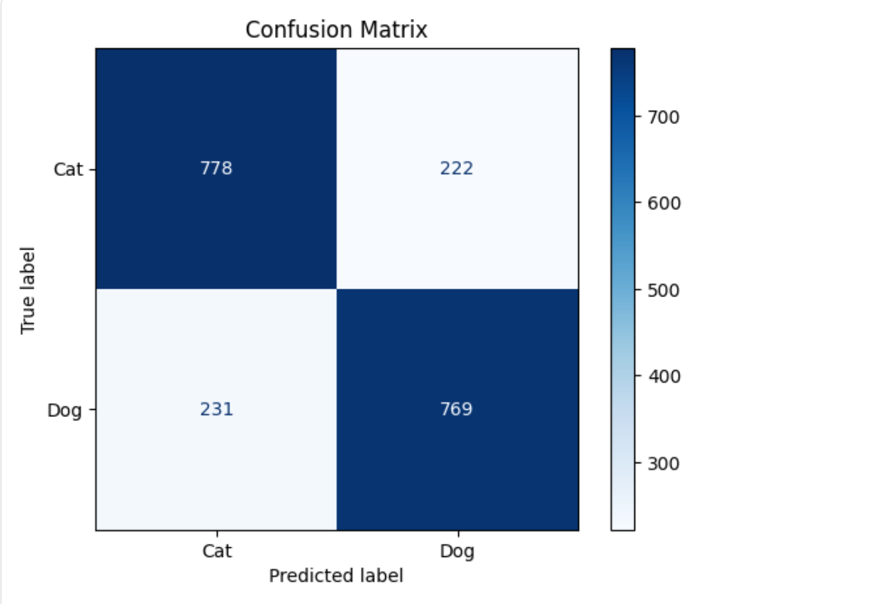
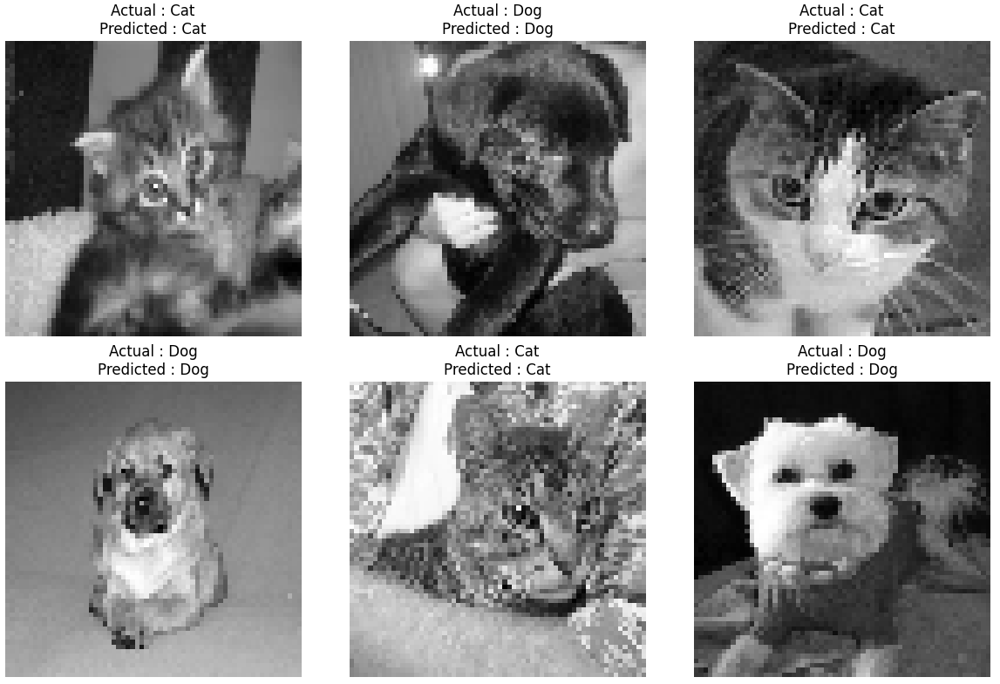

# Cats vs Dogs Image Classification using Support Vector Machine (SVM)

## Overview

This project implements a **Support Vector Machine (SVM)** to classify images of cats and dogs from the **Kaggle Cats vs Dogs** dataset. Images are resized, converted to grayscale, and transformed into **Histogram of Oriented Gradients (HOG)** features before being classified using an **RBF Kernel SVM**.

---

## Objective

To develop an image classification model capable of accurately distinguishing between **cats** and **dogs** using traditional machine learning techniques.

---

## Dataset

This project uses the **Microsoft Cats vs Dogs** dataset available on Kaggle.

The dataset contains:

- **5,000 Cat images**
- **5,000 Dog images**
- **Total Images:** 10,000

> **Dataset Download:** See `dataset_link.txt`

---

## Technologies Used

- Python
- Google Colab
- OpenCV
- NumPy
- Matplotlib
- Scikit-learn
- scikit-image

---

## Workflow

1. Load the image dataset.
2. Resize images to **64 × 64** pixels.
3. Convert images to grayscale.
4. Extract **HOG (Histogram of Oriented Gradients)** features.
5. Standardize the feature vectors.
6. Split the dataset into training and testing sets.
7. Train an **SVM classifier (RBF Kernel)**.
8. Predict labels for test images.
9. Evaluate model performance.
10. Visualize predictions and confusion matrix.

---

## Machine Learning Model

- **Algorithm:** Support Vector Machine (SVM)
- **Kernel:** Radial Basis Function (RBF)
- **Feature Extraction:** Histogram of Oriented Gradients (HOG)

---

## Evaluation Metrics

The model was evaluated using:

- Accuracy
- Precision
- Recall
- F1-Score
- Confusion Matrix

### Model Performance

| Metric | Score |
|---------|------:|
| Accuracy | **77.35%** |
| Precision | **0.77** |
| Recall | **0.77** |
| F1-Score | **0.77** |

---

## Results

The HOG + SVM model successfully classified cats and dogs with an overall **77.35% accuracy**.

The project also generates:

- Classification Report
- Confusion Matrix
- Sample Image Predictions

### Confusion Matrix



### Sample Predictions



---

## Project Structure

```
SCT_ML_3/
│
├── Cats_Dogs_SVM.ipynb
├── README.md
├── requirements.txt
├── dataset_link.txt
├── Confusion_Matrix.png
└── Sample_Predictions.png
```

---

## Requirements

Install the required libraries:

```bash
pip install -r requirements.txt
```

---

## How to Run

1. Download the dataset using the link provided in `dataset_link.txt`.
2. Upload the dataset to Google Colab.
3. Install the required dependencies.
4. Run all notebook cells.
5. View the evaluation metrics and prediction results.

---

## Future Improvements

- Hyperparameter tuning using GridSearchCV.
- Experiment with different HOG parameters.
- Compare SVM with Decision Tree, Random Forest, and KNN.
- Use transfer learning (MobileNetV2/ResNet50) for feature extraction while keeping SVM as the classifier.
- Increase image resolution to improve feature representation.

---

## Repository Contents

- **Cats_Dogs_SVM.ipynb** – Complete implementation
- **README.md** – Project documentation
- **requirements.txt** – Required Python libraries
- **dataset_link.txt** – Dataset download link
- **Confusion_Matrix.png** – Model evaluation
- **Sample_Predictions.png** – Sample prediction results

---

## Author

**Deepak Singh**

B.Tech Computer Science and Engineering  
Dr. B.R. Ambedkar National Institute of Technology (NIT) Jalandhar
